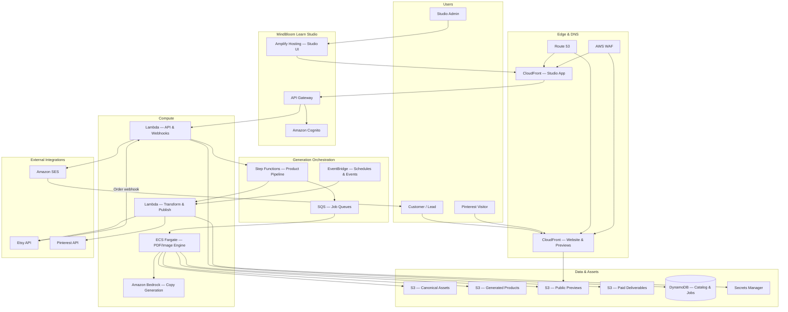

# MindBloom Learn Studio — AWS Architecture

> One-click platform for educational product generation, Etsy/Pinterest automation, watermarked previews, and monetizable asset bundles.

## Goals

| Capability | AWS approach |
|------------|--------------|
| Mascot Engine | DynamoDB metadata + canonical S3 assets (`assets/mascots/`) |
| Asset generation | Step Functions + Fargate (PDF/image compositing) + Bedrock (copy) |
| Watermark strategy | Dedicated preview pipeline → 150 DPI watermarked PDF |
| Paid deliverables | Private S3 + signed URLs → 300 DPI full PDF |
| Etsy automation | Lambda + Etsy API + generated listing assets in S3 |
| Pinterest automation | EventBridge schedules + Pinterest API |
| Revenue funnel | SES + webhooks + Step Functions post-purchase flow |
| Brand accuracy | Logo/mascot assets loaded from canonical S3 prefix |

---

## High-level architecture



---

## Core workflows

### 1. One-click product generation

```
Studio UI → API Gateway → Step Functions
  1. Validate product spec (product line, occasion, pages)
  2. Load mascot + logo from S3 canonical prefix
  3. Generate worksheet pages (Fargate + templates)
  4. Generate marketing copy (Bedrock)
  5. Assemble Product.pdf (300 DPI, no watermark)
  6. Assemble Product_Preview.pdf (pages 1–3, 150 DPI, diagonal watermark)
  7. Render EtsyCover.jpg, PinterestPin.jpg, WebsitePreview.jpg
  8. Write Description.txt, Tags.txt, SocialPosts.txt
  9. Persist metadata to DynamoDB; artifacts to S3
 10. Optional: publish Etsy listing + schedule Pinterest pin
```

### 2. Watermark & preview strategy

| Output | Storage | Access | Spec |
|--------|---------|--------|------|
| `Product.pdf` | `s3://…/paid/` | Signed URL after purchase | Full PDF, 300 DPI, no watermark |
| `Product_Preview.pdf` | `s3://…/previews/` | Public via CloudFront | First 2–3 pages, 150 DPI |
| Watermark text | Applied in Fargate | — | `MindBloom Learn™ FREE PREVIEW www.mindbloomlearn.com` |
| Watermark style | Applied in Fargate | — | Diagonal, 15–20% opacity, footer URL + QR |

### 3. Revenue funnel

```
Pinterest Pin (EventBridge scheduled)
  → CloudFront preview landing / website
  → Watermarked Product_Preview.pdf
  → Etsy listing (auto-generated cover + copy)
  → Etsy purchase webhook
  → Step Functions: verify order → signed URL → SES delivery
  → SES upsell sequence (bundle / subscription)
```

---

## AWS services (by layer)

### Edge & security

| Service | Purpose |
|---------|---------|
| **Route 53** | `mindbloomlearn.com`, `studio.mindbloomlearn.com`, `assets.mindbloomlearn.com` |
| **CloudFront** | CDN for website, preview PDFs, marketing images |
| **AWS WAF** | Rate limiting, bot control on Studio API and preview endpoints |
| **ACM** | TLS certificates for all domains |

### Studio application

| Service | Purpose |
|---------|---------|
| **Amplify Hosting** (or S3 + CloudFront) | React Studio admin — product wizard, job status, publish controls |
| **API Gateway (HTTP API)** | REST endpoints: `/products`, `/jobs`, `/publish/etsy`, `/publish/pinterest` |
| **Amazon Cognito** | Admin authentication (Mira Solutions team) |

### Orchestration

| Service | Purpose |
|---------|---------|
| **Step Functions** | Master product-generation state machine |
| **EventBridge** | Pinterest scheduling, seasonal campaigns, post-purchase emails |
| **SQS** | Decouple long-running render jobs; dead-letter queue for failures |
| **SNS** | Job-complete notifications to Studio UI (via WebSocket or polling) |

### Compute

| Service | Purpose |
|---------|---------|
| **ECS Fargate** | PDF assembly, watermark overlay, mascot/logo compositing, 300 DPI export |
| **Lambda** | API handlers, Etsy/Pinterest webhooks, lightweight transforms, S3 event triggers |
| **Amazon Bedrock** | Etsy descriptions, SEO tags, social post copy, activity prompts |

> **Why Fargate for PDF/image work:** Puppeteer/Sharp/ImageMagick workloads need more memory and predictable runtime than default Lambda limits. Lambda handles API and integration edges.

### Storage

#### S3 bucket layout

```
mindbloom-studio-prod/
├── canonical/                          # Source-of-truth assets (synced from repo)
│   ├── logo/mindbloomlearn.png
│   ├── mascots/Mindbloomlearn_Questy.png
│   ├── mascots/…
│   └── templates/
├── products/{productId}/
│   ├── source/                         # Intermediate worksheet pages
│   ├── Product.pdf                     # Paid — private
│   ├── Product_Preview.pdf             # Lead gen — public prefix
│   ├── EtsyCover.jpg
│   ├── PinterestPin.jpg
│   ├── WebsitePreview.jpg
│   ├── Description.txt
│   ├── Tags.txt
│   └── SocialPosts.txt
└── previews/                           # CloudFront origin for public previews
    └── {productId}/Product_Preview.pdf
```

| Bucket policy | Access |
|---------------|--------|
| `canonical/` | Read-only for Fargate task role |
| `products/{id}/Product.pdf` | Private; signed URLs only |
| `previews/` | CloudFront OAC public read |
| `EtsyCover.jpg`, `PinterestPin.jpg` | CloudFront or direct S3 for integrations |

### Database (DynamoDB)

| Table | PK | SK | Purpose |
|-------|----|----|---------|
| `ProductLines` | `LINE#colorquest` | `META` | Questy, accent colors, header style |
| `Mascots` | `MASCOT#questy` | `META` | Canonical S3 path, story, occasion rules |
| `Products` | `PRODUCT#{uuid}` | `META` | Status, product line, occasion, output keys |
| `Products` | `PRODUCT#{uuid}` | `JOB#{step}` | Pipeline step status |
| `Occasions` | `OCCASION#fathers-day` | `META` | Theme colors, allowed mascot variants |
| `Listings` | `ETSY#{listingId}` | `META` | Etsy listing ↔ product mapping |
| `Pins` | `PIN#{pinId}` | `SCHEDULE#{iso}` | Pinterest schedule metadata |

> Mascot stories and accent colors can be seeded from `index.html` → `mascotStories` and canonical PNG paths under `assets/mascots/`.

### Secrets & config

| Service | Contents |
|---------|----------|
| **Secrets Manager** | Etsy API key, Pinterest token, webhook HMAC secrets |
| **Systems Manager Parameter Store** | Watermark opacity (0.15–0.20), preview page count (2–3), DPI values |

### Email & notifications

| Service | Purpose |
|---------|---------|
| **Amazon SES** | Free pack opt-in, purchase delivery, upsell drips |
| **SES Configuration Sets** | Open/click tracking for funnel analytics |

### Integrations

| Integration | AWS pattern |
|-------------|-------------|
| **Etsy** | Lambda publishes listing; API Gateway receives order webhooks |
| **Pinterest** | EventBridge → Lambda creates/schedules pins using `PinterestPin.jpg` |
| **Website (GitHub Pages)** | Continues hosting marketing site; Studio publishes preview URLs and assets |

### Observability

| Service | Purpose |
|---------|---------|
| **CloudWatch Logs** | Lambda, Fargate, API Gateway logs |
| **CloudWatch Metrics & Alarms** | Job failure rate, queue depth, Step Functions failures |
| **X-Ray** | End-to-end trace across API → Step Functions → Fargate |
| **AWS Backup** | S3 bucket backup for `canonical/` and `products/` |

---

## IAM roles (summary)

| Role | Permissions |
|------|-------------|
| `StudioApiLambdaRole` | DynamoDB read/write, Step Functions start, S3 read canonical |
| `ProductPipelineFargateRole` | S3 read/write products, read canonical, CloudWatch logs |
| `PublishLambdaRole` | Secrets Manager read, Etsy/Pinterest API calls, S3 read marketing assets |
| `CloudFrontOACRole` | S3 read on `previews/` prefix only |
| `EventBridgeSchedulerRole` | Invoke publish Lambda on schedule |

---

## Mascot & brand rules (architecture enforcement)

These business rules are enforced in the **Generation Service** (Fargate task config + DynamoDB metadata):

1. **Default mascots** — load PNG from `canonical/mascots/`; no generative redraw
2. **Occasion mascots** — `Occasions` table allows theme color/prop overrides; base identity unchanged
3. **Logo** — always composite `canonical/logo/mindbloomlearn.png`; flower mark never approximated
4. **Product line mapping** — `ProductLines` ↔ `Mascots` join enforced at pipeline validation step

---

## Network topology

```
Internet
  └── Route 53
        ├── CloudFront (www) → GitHub Pages origin OR S3 static site
        ├── CloudFront (assets) → S3 previews + marketing images
        └── CloudFront (studio) → Amplify
              └── API Gateway → Lambda (public + Cognito authorizer)
                    ├── Step Functions (private)
                    ├── ECS Fargate (private subnets + NAT)
                    ├── DynamoDB (VPC endpoint)
                    └── S3 (VPC gateway endpoint)
```

Fargate tasks run in **private subnets** with NAT for Bedrock/Etsy/Pinterest egress. No public IPs on workers.

---

## Phased rollout

### Phase 1 — Foundation (MVP)
- S3 canonical sync from `mindbloomlearn.com/assets`
- DynamoDB mascot/product-line seed data
- Step Functions + Fargate: generate PDF + watermarked preview
- Studio UI: create product, download outputs

### Phase 2 — Monetization
- Etsy webhook → paid PDF delivery via SES
- CloudFront public preview distribution
- QR code + footer watermark on preview pages

### Phase 3 — Marketing automation
- Bedrock copy generation (Description, Tags, SocialPosts)
- Etsy listing publish Lambda
- Pinterest scheduled pins via EventBridge

### Phase 4 — Scale
- Bundle generation, subscription upsell sequences
- Multi-occasion template library
- Cost optimization: Fargate Spot for batch renders

---

## Estimated monthly cost (starter)

| Service | Estimate (low traffic) |
|---------|------------------------|
| S3 + CloudFront | $5–20 |
| DynamoDB on-demand | $1–10 |
| Lambda + API Gateway | $1–5 |
| Fargate (pay per job) | $10–50 |
| Bedrock | $5–30 |
| SES | $1–5 |
| Cognito | Free tier |
| **Total** | **~$25–120/mo** |

Costs scale with generation volume; Fargate Spot and S3 Intelligent-Tiering reduce spend at higher volume.

---

## Reference outputs (per product)

Aligned with Studio Blueprint v2:

| File | Generated by | Storage |
|------|--------------|---------|
| `Product.pdf` | Fargate PDF engine | S3 paid (private) |
| `Product_Preview.pdf` | Fargate + watermark service | S3 previews (public) |
| `EtsyCover.jpg` | Fargate image compositor | S3 products |
| `PinterestPin.jpg` | Fargate (vertical 2:3 template) | S3 products |
| `WebsitePreview.jpg` | Fargate | S3 products |
| `Description.txt` | Bedrock | S3 products |
| `Tags.txt` | Bedrock | S3 products |
| `SocialPosts.txt` | Bedrock | S3 products |

---

## Next steps

1. Create Terraform/CDK stack for Phase 1 (S3, DynamoDB, Step Functions, Fargate)
2. Seed DynamoDB from existing `assets/` and `mascotStories`
3. Build Fargate container: template renderer + watermark + logo/mascot compositor
4. Studio UI product wizard wired to `POST /products/generate`
